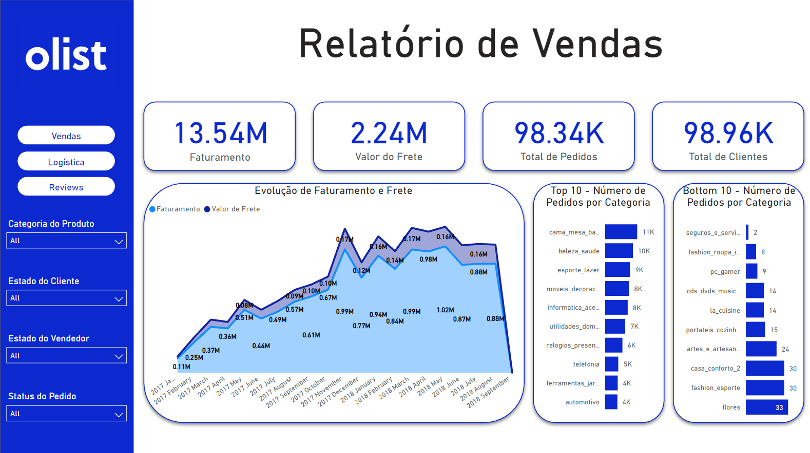

# DashboardOlist

O projeto foi desenvolvido a partir de uma solicitação hipotética de construção de um painel para a visualização dos dados a partir de três perspectivas: vendas, logística e satisfação do cliente. Os dados escolhidos para o projeto são os disponibilizados pela Olist através da plataforma Kaggle no qual estão dispostos cem mil pedidos com dados sobre produtos, clientes, vendedores, avaliações, formas de pagamento e a geo localização destes, e podem ser acessados através deste <a href="https://www.kaggle.com/datasets/olistbr/brazilian-ecommerce?datasetId=55151&sortBy=voteCount&sort=votes&select=olist_geolocation_dataset.csv">link</a>. O conjunto de dados está organizado em oito tabelas em um modelo relacional.

A partir daí construiu-se um fluxo de dados através da ferramenta DataFlow do Power BI Service para fazer o processo de ETL (Extract, Transform and Load) dos dados a fim de proporcionar dinamismo para uma eventual futura aplicação deste conjunto de dados. Foi feita então a conexão deste fluxo de dados para uma aplicação no Power BI desktop e construiu-se o dashboard. O projeto foi então publicado através do Power BI Service.

Ao longo do desenvolvimento do projeto houve a necessidade de ferramentas mais robustas para a transformação dos dados de geolocalização dos CEP 's de clientes e vendedores. A ferramentas utilizadas foram principalmente as bibliotecas GeoPandas, Pandas e Shapely para a remoção de dados que não faziam sentido na realidade e agregação de valores para uma melhor performance.

O resultado final do projeto pode ser acessado <a href="https://app.powerbi.com/view?r=eyJrIjoiNTRmOGIyYTQtN2U2NC00NTVmLWIxZjktZDNlMmVkYzdlNWIzIiwidCI6IjFkNWVmZGJiLTQxNjUtNDUzMi05NDE5LWQ5N2FmYzgwZTBkOSJ9">aqui</a> através da ferramenta de publicação do Power BI Service.O arquivo detalhado sobre os passos tomados durante o projeto pode ser acessado através deste <a href="https://docs.google.com/document/d/1Tq_ydfXk-y39-SbvzDk66linlrURUAteG2Sm17CqLuk/edit">link</a>. Dúvidas, sugestões e feedbacks no geral são sempre muito bem vindos.
